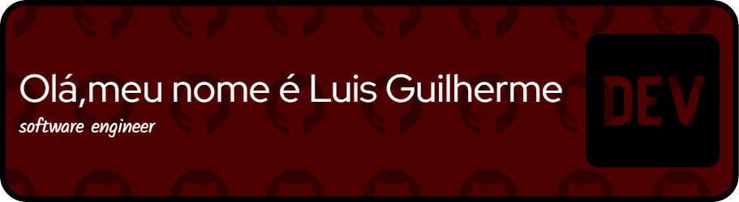

# Sobre Mim  

✨ **Olá!** 👋 Eu sou Luis Guilherme, um desenvolvedor apaixonado por tecnologia e inovação. Sempre em busca de superar limites, acredito no poder do aprendizado contínuo para transformar ideias em soluções práticas e impactantes. Atualmente, estou focado em expandir minhas habilidades no desenvolvimento web, programação orientada a objetos e frameworks modernos.  

Sou uma pessoa curiosa e motivada, sempre pronta para aprender e me adaptar a novos desafios. Minha jornada na tecnologia começou pela curiosidade de entender como sistemas e websites funcionam, e, ao longo do tempo, isso se transformou em uma paixão que guia minha carreira.  

Além do desenvolvimento técnico, também valorizo o trabalho em equipe e a troca de conhecimento. Acredito que colaborar com outras pessoas traz não apenas melhores soluções, mas também um aprendizado mais enriquecedor.  

## Características  

- 💪 **Esforçado**: Sou dedicado e comprometido em alcançar meus objetivos, sempre buscando superar desafios com determinação.  
- 🚀 **Aprendizado Rápido**: Tenho facilidade em aprender novas linguagens, frameworks e ferramentas, o que me permite me adaptar rapidamente a diferentes projetos.  
- 📚 **Atualização Constante**: Estou sempre em busca de aprender algo novo, seja através de cursos, projetos práticos ou leitura de materiais técnicos.  
- 💻 **Experiência com Desenvolvimento Web**: Iniciei minha jornada aprendendo HTML5 e CSS3, e desde então tenho aprimorado minhas habilidades em front-end e programação geral.  
- 🎓 **Estudante no Instituto de Ensino Superior ICEV**: Estou em constante evolução acadêmica, aprimorando meu conhecimento técnico e teórico.  
- ⚛️ **Participação na LAESA**: Ligante da Liga Acadêmica de Engenharia de Software (LAESA), onde colaboro em projetos acadêmicos e troco experiências com colegas.  
- 🌐 **Objetivos Profissionais**:  
  - Especializar-me em desenvolvimento full-stack, com foco em Java e Spring Boot.  
  - Explorar áreas como automação, criação de jogos, Python, cibersegurança e inteligência artificial.  
- 🐧 **Usuário Linux**: Uso o **Manjaro Linux** como sistema principal e tenho entusiasmo por explorar novas distribuições Linux, aprendendo constantemente sobre diferentes ambientes e ferramentas do mundo open source.  

## Tecnologias Já Praticadas  

-   
-   
-   
-   

## Tecnologias em Prática  

-   
-   
-   

## Contato  

  
    
    

  

## Principais Projetos  

- **Projeto 1:** [Mylinks](https://github.com/lguimorais/pagina_mylinks)  
  - Um site desenvolvido utilizando HTML, CSS e JavaScript, que permite aos usuários criar e compartilhar listas personalizadas de links. Ele organiza recursos da web de forma prática, oferecendo opções de categorização e compartilhamento.  

- **Projeto 2:** [Calculadora](https://github.com/lguimorais/calculadora)  
  - Calculadora em C que realiza operações básicas como multiplicação, soma, subtração e divisão. Uma ferramenta eficiente para cálculos matemáticos cotidianos.  

- **Projeto 3:** [Cadastro de Plano de Saúde](https://github.com/lguimorais/cadastro_plano_de_saude)  
  - Sistema de cadastro de planos de saúde em C que registra informações como nome do titular, quantidade de dependentes e valores do plano. Um projeto focado no gerenciamento organizado de dados.  

- **Projeto 4:** [Trabalho Hotel](https://github.com/lguimorais/TrabalhoHotel.git)  
  - Sistema em Java para gerenciar operações de hotéis, com funcionalidades para cadastro de hóspedes, quartos e reservas. Um exemplo de aplicação prática para gestão hoteleira.  

# Bem-vindo ao meu GitHub! 🌟  
